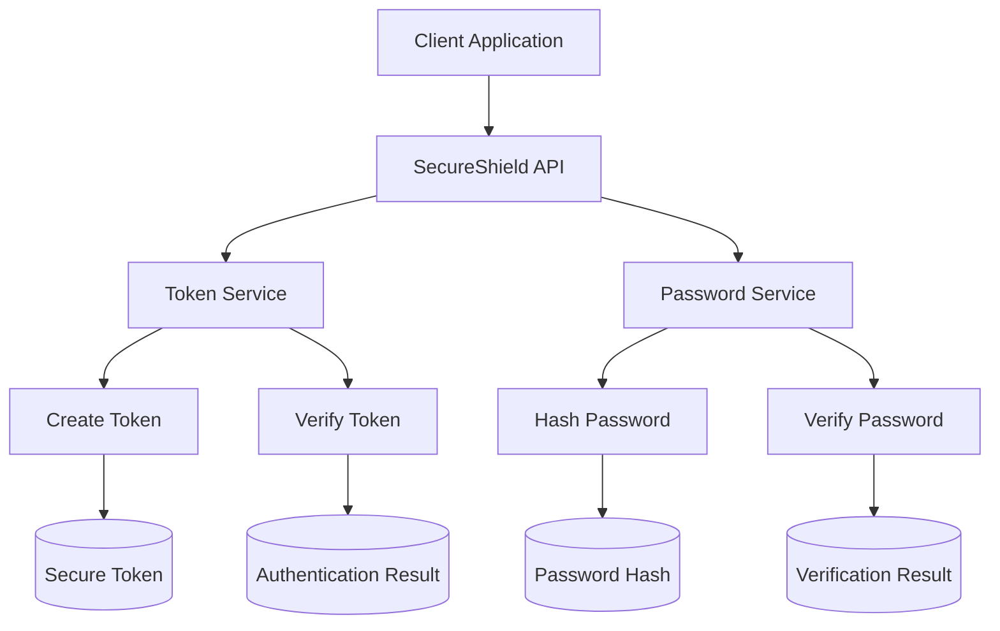
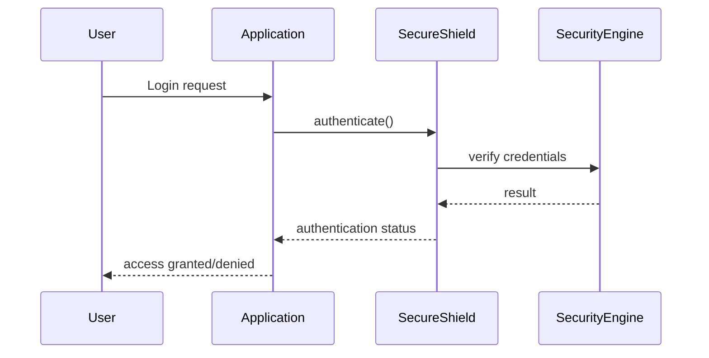

# 🛡️ SecureShield

SecureShield is a beginner-friendly, enterprise-grade Java security library designed to make backend security simple, fast, and easy to integrate.

It provides simple APIs for token authentication, password hashing, and system protection — without the complexity of traditional frameworks.

---

# ✨ Features

- 🔐 Token creation and verification
- 🔑 Password hashing and validation
- ⚡ Lightweight and fast
- 🧩 Modular design
- 👶 Beginner-friendly API
- 📦 Easy Maven integration

Upcoming:

- JWT cryptographic tokens
- Rate limiting
- Role-based access control
- Session management
- Attack detection and logging

---

# 🚀 Quick Start

## Create Token

```java
String token = SecureShield.createToken("ayush");
```

## Verify Token

```java
boolean valid = SecureShield.verifyToken(token);
```

## Hash Password

```java
String hash = SecureShield.hashPassword("mypassword");
```

## Verify Password

```java
boolean match = SecureShield.checkPassword("mypassword", hash);
```

---

# 🏗️ Architecture Diagram



---

# ⚙️ How SecureShield Works



---

# 📁 Project Structure

```
secureshield/
│
├── pom.xml
├── README.md
│
├── src/main/java/com/secureshield/
│   ├── core/
│   │   └── SecureShield.java
│   │
│   ├── jwt/
│   ├── password/
│   └── util/
│
└── target/
```

---

# 📦 Installation (Maven)

```xml
<dependency>
    <groupId>com.secureshield</groupId>
    <artifactId>secureshield</artifactId>
    <version>1.0.0</version>
</dependency>
```

---

# 🎯 Design Goals

SecureShield is designed to be:

- Easy for beginners
- Secure for production
- Lightweight and fast
- Easy to extend
- Easy to integrate

---

# 🧠 Example Usage

```java
import com.secureshield.core.SecureShield;

public class Example {

    public static void main(String[] args) {

        String token = SecureShield.createToken("ayush");

        boolean valid = SecureShield.verifyToken(token);

        System.out.println(valid);
    }
}
```

---

# 🔮 Future Roadmap

- JWT cryptographic implementation
- Secure password hashing (BCrypt)
- Rate limiting system
- Role-based access control
- Attack detection
- Audit logging

---

# 🤝 Contributing

Contributions are welcome.

Steps:

1. Fork the repository
2. Create feature branch
3. Commit changes
4. Push branch
5. Create Pull Request

---

# 📜 License

MIT License

---

# ⭐ Support

If you find SecureShield useful, please give it a star.
